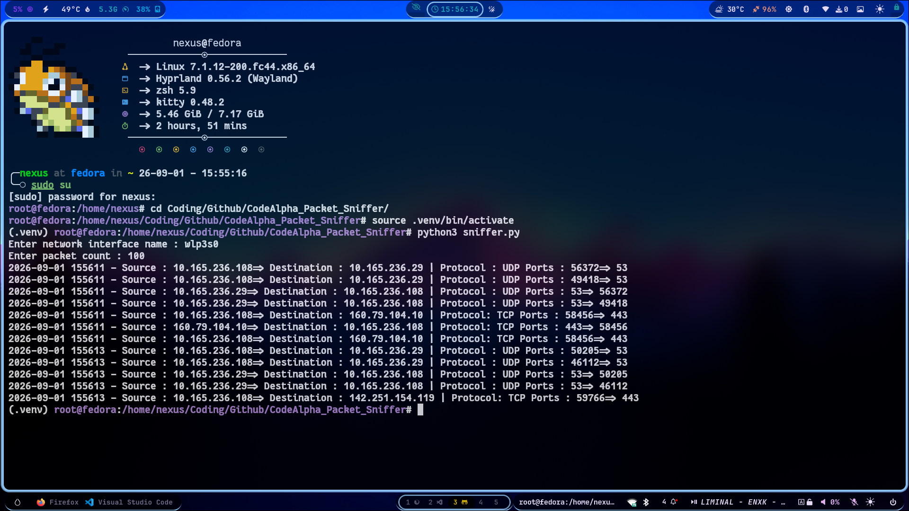

# Basic Network Packet Sniffer 
A Network Packet Sniffer tool is used to capture and analyze network traffic. It intercepts and records network packets.

This tool capture packets, analyze and display the analyzed packet into human readable format to the user.


### Network Packet Sniffer Uses
- Troubleshooting

- Security Analysis

- Network optimization

### Components of sniffer :
1. Hardware : Network adapter to capture network traffic
2. Capture Driver : Captures the network traffic from interface then filters that network traffic for information we want and store the information in a buffer.
3. Buffer : To store captured data 
4. Decoder : Converts packets binary data into human reable format 

### Workflow of Packet sniffer :
``` open log file ==> sniff() starts listening ==> handle_packet() runs ==> close log file```

### Requirements 
- Python 3.14.7
- Scapy 
- datetime 

### To run :
```sudo python3 sniffer.py```

## Screenshots

